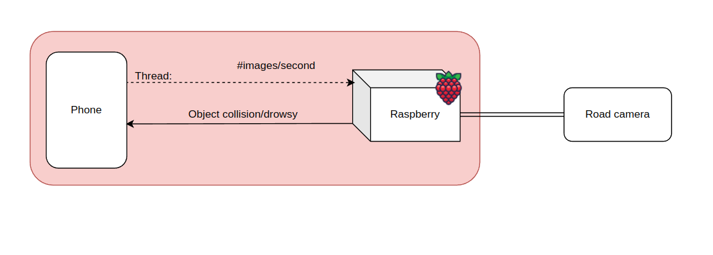
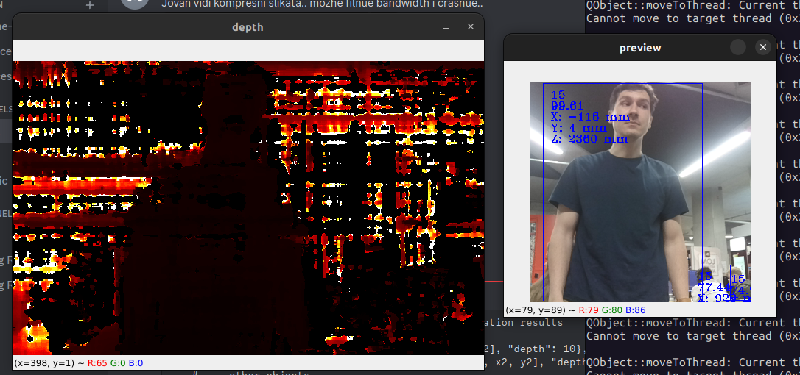
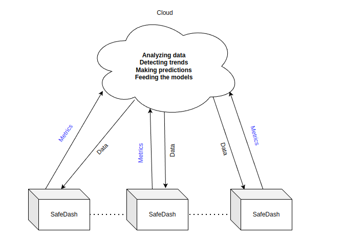

# Safe (-) - Safe Dash

## Problem
Many drivers of older, budget cars lack access to advanced safety features like drowsiness detection and collision warning systems. This can lead to dangerous driving conditions and increase the risk of accidents.

To illustrate, in 2024, more than 25% of all cars in the U.S. are at least 17 years old. Another study conducted by the National Highway Traffic Safety Administration showed that older cars are involved in more accidents on average, with a higher percentage of those accidents being fatal.

## Solution
Introducing **Safe Dash**—an affordable, easy-to-install safety system that detects driver drowsiness and warns of potential collisions. Powered by AI and simple cameras, Safe Dash offers real-time alerts to keep drivers awake and aware on the road, without the need for expensive smart cars.

## Our system
- **Stereo road camera ([Luxonis OAK D-Lite](https://shop.luxonis.com/collections/oak-cameras-1/products/oak-d-lite-1?variant=42583102456031))**
- **Raspberry Pi 5**
- **Android mobile Application/Embedded Camera**

## Features

- **Drowsiness Detection**: Using a front camera from a phone, Safe Dash monitors eye movements to detect signs of drowsiness, triggering alerts when needed.
- **Collision Warning**: Combining data gathered by the road camera, Safe Dash predicts and warns about imminent collisions, giving drivers crucial time to react.
- **Plug-and-Play**: Designed to be easily installed in any car, DriveGuard works without complex wiring or modifications.

# Architecture

# Road camera

# Future Improvements

- **Connecting to Radio**:
  - Interrupt the radio with safety alerts to ensure drivers are immediately informed of important warnings.

- **Adding More Cameras**:
  - Integrate additional cameras for enhanced functionality, such as a parking helper and improved blind spot detection.

- **Adding Voice Control**:
  - Enable hands-free interaction with the system to reduce distractions and improve safety.

- **Road Sign Detection**:
  - Implement AI-based road sign recognition to alert drivers to speed limits, stop signs, and other important road information.

- **Lane Departure Warning**:
  - Use camera-based technology to detect unintentional lane changes and provide early warnings to drivers.

# Additional notice

This wasn't the cheapest optimal system, but the one we developed for demo.
